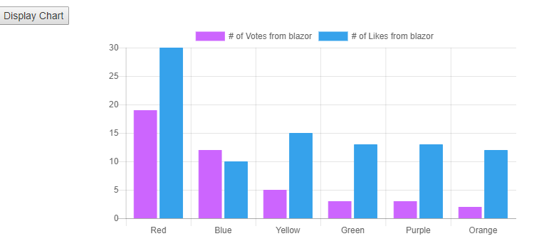

## Simple Components for Blazor Projects

```
Note: Just as Blazor, this repo is also experimental.
```

If you like the idea of this repo leave your feedback as an issue or star the repo or let me know on [@ma_khan](https://twitter.com/ma_khan)

Currently, starting with a simple [ChartJS](https://github.com/chartjs/Chart.js) implementation. 


## Prerequisites

Don't know what Blazor is? Read [here](https://github.com/aspnet/Blazor)

Complete all Blazor dependencies.

1. Latest VS Preview
2. DotNetCore 2.1 Preview 2


## Installation 

 


To Install 

```
Install-Package BlazorComponents
```
or 
```
dotnet add package BlazorComponents
```

## Usage

1. In cshtml file add this:

```html
<div class="row">
    <button class="btn btn-primary" onclick="@UpdateChart">Update Chart </button>
</div>
<ChartJsLineChart ref="lineChartJs" Chart="@blazorLineChartJS" Width="600" Height="300" />
```

```csharp
@functions{

    public ChartJSChart<ChartJsLineDataset> blazorLineChartJS { get; set; } = new ChartJSChart<ChartJsLineDataset>();
    ChartJsLineChart lineChartJs;

    protected override void OnInit()
    {

        blazorLineChartJS = new ChartJSChart<ChartJsLineDataset>()
        {
            ChartType = "line",
            CanvasId = "myFirstLineChart",
            Options = new ChartJsOptions()
            {
                Text = "Sample chart from Blazor",
                Display = true,
                Responsive = false
            },
            Data = new ChartJsData<ChartJsLineDataset>()
            {
                Labels = new List<string>() { "Red", "Blue", "Yellow", "Green", "Purple", "Orange" },
                Datasets = new List<ChartJsLineDataset>()
                 {
                        new ChartJsLineDataset()
                        {
                            BackgroundColor = "#ff6384",
                            BorderColor = "#ff6384",
                            Label = "# of Votes from blazor",
                            Data = new List<int>{ 19,12,5,3,3,2},
                            Fill = false,
                            BorderWidth = 2,
                            PointRadius = 3,
                            PointBorderWidth=1
                        }
                 }
            }
        };
    }

    public void UpdateChart()
    {
        //Update existing dataset
        blazorLineChartJS.Data.Labels.Add($"New{DateTime.Now.Second}");
        var firstDataSet = blazorLineChartJS.Data.Datasets[0];
        firstDataSet.Data.Add(DateTime.Now.Second);

        //Add new dataset
        //blazorLineChartJS.Data.Datasets.Add(new ChartJsLineDataset()
        //{
        //    BackgroundColor = "#cc65fe",
        //    BorderColor = "#cc65fe",
        //    Label = "# of Votes from blazor 1",
        //    Data = new List<int> {20,21,12,3,4,4},
        //    Fill = true,
        //    BorderWidth = 2,
        //    PointRadius = 3,
        //    PointBorderWidth = 1
        //});

        lineChartJs.UpdateChart(blazorLineChartJS);
    }
}
```

2. In index.html add:

```html
    <script src="//cdnjs.cloudflare.com/ajax/libs/Chart.js/2.7.2/Chart.min.js"></script>
    <script type="blazor-boot">
    </script>
```


## Sample Output

Bar Chart Example:



