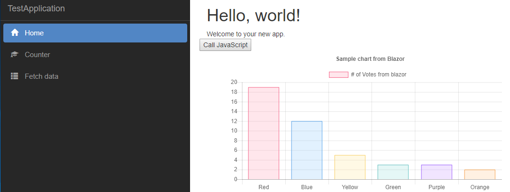

## Simple Components for Blazor Projects

Don't know what Blazor is? Read [here](https://github.com/aspnet/Blazor)

Currently, starting with a simple [ChartJS](https://github.com/chartjs/Chart.js) implementation. 

Here's how you can use it:

There are several steps at this point to get this to work.

1. You need to complete all Blazor dependencies.
2. Grab a copy from Nuget [TODO] OR clone and build from source. 
3. Samples contains a simple implementation. 
4. If you want to do it within your project:

In your cshtml file add this:

```html
<ChartJS Chart="@blazorChartJS" Width="600" Height="300" />
```

```csharp
@functions {

    public ChartJSChart blazorChartJS { get; set; } = new ChartJSChart();

    protected override void OnInit()
    {
        blazorChartJS = new ChartJSChart()
        {
            ChartType = "bar",
            CanvasId = "myFirstChart",
            Options = new ChartJsOptions()
            {
                Text = "Sample chart from Blazor",
                BorderWidth = 1,
                Display = true
            },
            Data = new ChartJsData()
            {
                Labels = new List<string>() { "Red", "Blue", "Yellow", "Green", "Purple", "Orange" },
                Datasets = new List<ChartJsDataset>()
            {
                new ChartJsDataset()
                {
                Label = "# of Votes from blazor",
                Data = new List<int>(){ 19,12,5,3,3,2}
                }
            }
            }
        };
    }

}
```

Thats all.

Run the project and you will need to click on the Display Chart button. 



