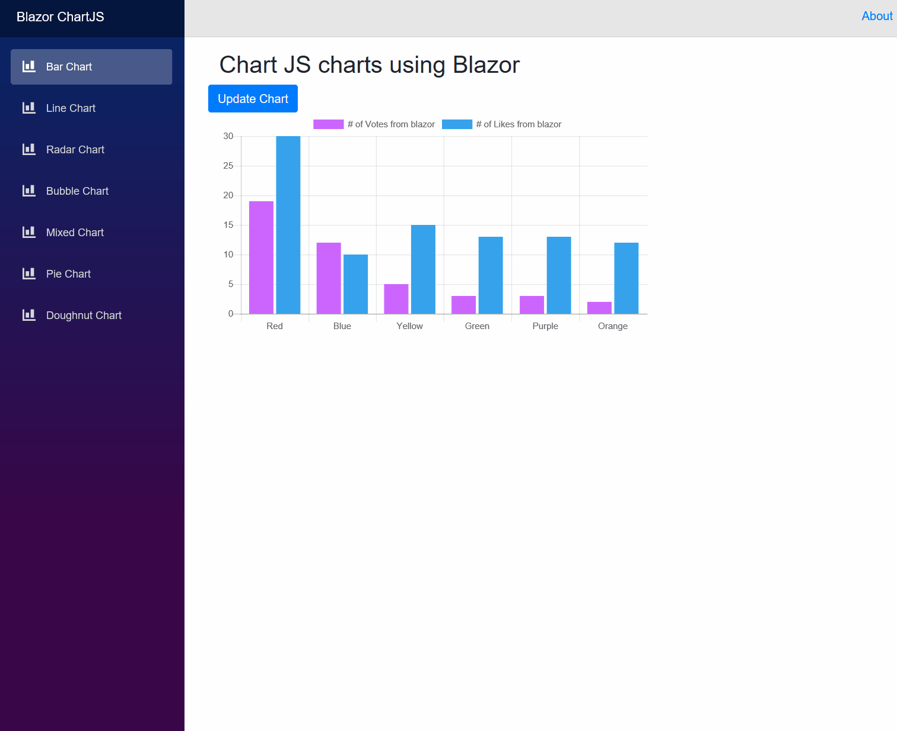

## ChartJs interop with Blazor


[](https://dev.azure.com/marius-muntean/ChartJs.Blazor/_build/latest?definitionId=4)
[](https://www.nuget.org/packages/ChartJs.Blazor.Fork/)


This is a Blazor Component that wraps [ChartJS](https://github.com/chartjs/Chart.js).
You can use the library in both client- and server-side projects. See the samples or reach out on Twitter if you need help.

#
## Status Update
The project was abandoned for some time and it is now being revived. 
The plan is to update it to the latest Blazor version, update the samples and then to continue with nomal development.
[@Joelius300](https://github.com/Joelius300) kept the project alive and developed it further; here's the repo https://github.com/Joelius300/ChartJSBlazor. We've agreed to integrate his work back into this repository.

If you can't wait until the project is up and running again and you need an updated NuGet package of the library, you can use Joelius300's package: https://www.nuget.org/packages/ChartJs.Blazor.Fork/

[](https://www.nuget.org/packages/ChartJs.Blazor.Fork/)

Many thanks to [@Joelius300](https://github.com/Joelius300)! Without your input the project wouldn't have been revived.

## Need your opinion

Let me know how you like ChartJs.Blazor on Twitter [@MunteanMarius](https://twitter.com/@MunteanMarius )

Vote on what features you'd like to see implemented next
[Link to Poll](https://linkto.run/p/CTWCSM51)

Currently I've implemented support for all ChartJs charts. Do you miss anything that makes ChartJs.Blazor a show stopper?

## Changelog
<details open="open">
<summary>v0.9.0</summary>

* Added support for Blazor and Razor Components projects
* Updated to ChartJs 2.8
* Fixed vanishing-chart-bug (thanks community)
* Refactored the core classes of the library so they don't feel so hacky anymore (thanks community)

</details>

<details>
<summary>v0.7.0</summary>

* Updated to Blazor v0.7.0
* Check out the updated samples page. I moved it to [www.iheartblazor.com](https://www.iheartblazor.com)

</details>

<details>
<summary>v0.6.0</summary>

* Extended the support for Legent Item click and hover evnt handler.
* Check out the updated samples page. You can now interact with the chart dataset.

</details>

<details><summary>v0.5.0</summary>

* Added support for Chart Legends with custom Js functions for handling onClick, onHover events for Legend Items.
* Check out the updated samples page. You can now interact with the chart dataset.

</details>

<details ><summary>0.4.0-alpha</summary>

* Simplified some behind-the-scenes code
* Added support for Scatter Chart
* Improved the samples and updated the gif
</details>

<details><summary>0.3.0-alpha</summary>

* Updated object model that exposes even more features of ChartJs
* Added support for Polar Area Chart
</details>

<details><summary>0.2.0-alpha</summary>

* Updated object model that exposes more features of ChartJs
</details>

<details><summary>0.1.0-alpha</summary>

* Initial release. 
* Support for almost all charts from ChartJs, including: LineChart, BarChart, RadarCart, Doughnut- and Pie-Chart, BubbleChart, MixedChart
</details>

## Please keep in mind that this is still a preview. Expect breaking changes during the next releases. I'm using this opportunity to learn Blazor.

## Prerequisites

Don't know what Blazor is? Read [here](https://github.com/aspnet/Blazor)

Prerequisites.

1. Visual Studio 15.8 or later
2. DotNetCore 2.1.402 or later


## Installation 

There's a NuGet package: https://www.nuget.org/packages/ChartJs.Blazor.Fork

Install from the command line:

```
Install-Package ChartJs.Blazor.Fork -Version 0.10.3-preview
```
or 
```
dotnet add package ChartJs.Blazor.Fork --version 0.10.3-preview
```
**Note:** For server-side projects make sure to add the following line to the `Configure(...)` method of your `Startup.cs` file
```csharp
ChartJsBlazor.AddStaticResourcesToWebRootPath(env.WebRootPath);
```
Then reference the ChartJsInterop.js file from your index.(cs)html like so
```HTML
<script src="~/ChartJs.Blazor/ChartJsInterop.js" type="text/javascript" language="javascript"></script>
```

## Usage

For detailed instruction go to the [Wiki page](https://github.com/mariusmuntean/ChartJs.Blazor/wiki). 

1. In you cshtlm create a new ChartJsPieChart and give it an instance of PieChartConfig ...

```html
<h2>Chart JS charts using Blazor</h2>
<div class="row">
    <button class="btn btn-primary" onclick="@UpdateChart">Update Chart </button>
</div>
<ChartJsPieChart ref="pieChartJs" Config="@pieChartConfig" Width="600" Height="300"/>
```

... make sure to create that instance
```csharp
@functions{

    private PieChartConfig pieChartConfig { get; set; }
    ChartJsPieChart pieChartJs;

    protected override void OnInit()
    {
        pieChartConfig = pieChartConfig ?? new PieChartConfig
        {
            CanvasId = "myFirstPieChart",
            Options = new PieChartOptions
            {
                Text = "Sample chart from Blazor",
                Display = true,
                Responsive = true,
                Animation = new PieChartAnimation {AnimateRotate = true, AnimateScale = true}
            },
            Data = new PieChartData
            {
                Labels = new List<string> {"A", "B", "C", "D"},
                Datasets = new List<PieChartDataset>
                {
                    new PieChartDataset
                    {
                        BackgroundColor = new[] {"#ff6384", "#55ee84", "#4463ff", "#efefef"},
                        Data = new List<int> {4, 5, 6, 7},
                        Label = "Light Red",
                        BorderWidth = 0,
                        HoverBackgroundColor = new[] {"#f06384"},
                        HoverBorderColor = new[] {"#f06384"},
                        HoverBorderWidth = new[] {1}, BorderColor = "#ffffff",
                    }
                }
            }
        };
    }
}
```

2. In your index.html add these

```html
    .
    .
    .
<body>
    <app>Loading...</app>

    <!--<script src="css/bootstrap/bootstrap-native.min.js"></script>-->
    <script src="//cdnjs.cloudflare.com/ajax/libs/Chart.js/2.7.2/Chart.min.js"></script>
    <!--<script src="https://cdnjs.cloudflare.com/ajax/libs/Chart.js/2.5.0/Chart.bundle.min.js"></script>-->
    <link rel="stylesheet" href="//cdnjs.cloudflare.com/ajax/libs/highlight.js/9.12.0/styles/default.min.css">
    <script src="//cdnjs.cloudflare.com/ajax/libs/highlight.js/9.12.0/highlight.min.js"></script>
    <!--<script type="blazor-boot">
            </script>-->
    <script src="_framework/blazor.webassembly.js" type="text/javascript" language="javascript"></script>
    <script src="ChartJsInterop.js" type="text/javascript" language="javascript"></script>
</body>
    .
    .
    .
```


## Samples

Test it in your browser: https://www.iheartblazor.com/


Or just watch me click through the samples



# Contributors
This projects slowly develops a community which started to give back.
## Many thanks to: #
 **Lars** (https://github.com/larshg)
 
 **Jan** (https://github.com/mashbrno)

 I'm very gratefull for your contributions!